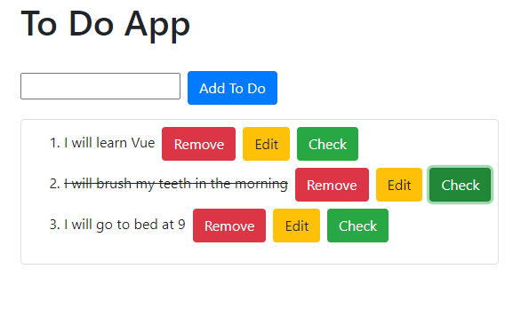
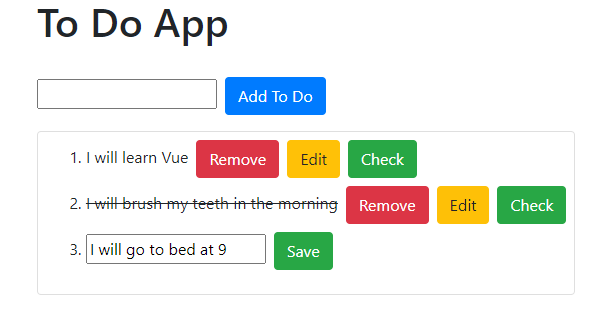

# TO Do list using Vue JS

## Introduction
This is a to do list app using vue js and bootstrap. Bootstrap is loaded via external url. You may load that locally.

## Demo
Try the demo here: https://vue-todo-master99.herokuapp.com

## Screenshots



## Project setup
```
npm install
```

### Compiles and hot-reloads for development
```
npm run serve
```

### Compiles and minifies for production
```
npm run build
```

### Lints and fixes files
```
npm run lint
```

### Customize configuration
See [Configuration Reference](https://cli.vuejs.org/config/).
